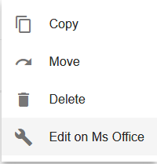
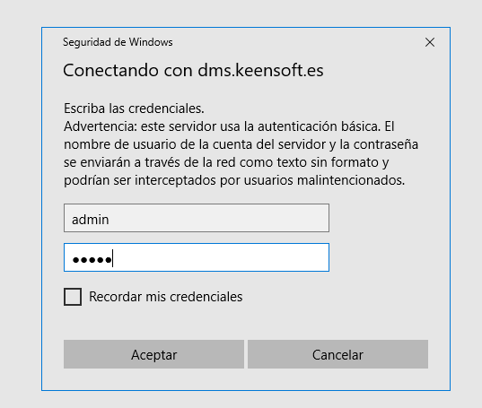
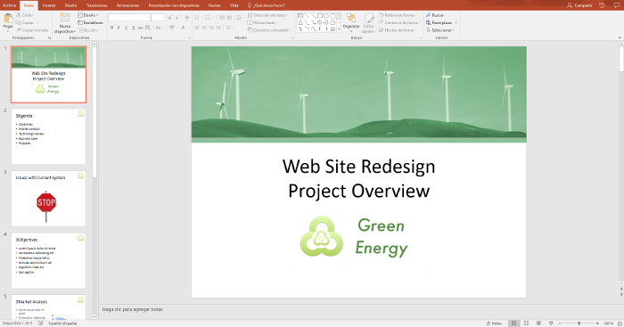

# ng2-alfresco-aos-editonline

<!-- markdown-toc start - Don't edit this section.  npm run toc to generate it-->

<!-- toc -->

- [Prerequisites](#prerequisites)
- [Install](#install)
- [Basic usage](#basic-usage)
- [alfresco-tag-node-actions-list](#alfresco-tag-node-actions-list)
  * [Properties](#properties)
- [alfresco-tag-node-list](#alfresco-tag-node-list)
  * [Properties](#properties-1)
- [alfresco-tag-list](#alfresco-tag-list)
- [Build from sources](#build-from-sources)
- [NPM scripts](#npm-scripts)
- [Demo](#demo)
- [License](#license)

<!-- tocstop -->

<!-- markdown-toc end -->

## Description

This module provides the **Edit on Ms Office** action present in Alfresco Share to be used on ADF (Alfresco Development Framework) applications. 

The module was developed during the [Alfresco Global Hackathon 2017](https://community.alfresco.com/docs/DOC-7046-projects-and-teams-global-virtual-hack-a-thon-2017) and it was a lot of fun to do it. The idea of the "Alfresco Share ADF Components" project is to create angular reusable components holding functionalities present on Alfresco Share and often used by our clients.

Special thanks to [Mario Romano](https://github.com/magemello) for kindly and patiently responding all my questions :P

## Prerequisites

Before you start using this module, make sure you have properly installed and configured Alfresco Office Services (AOS) on your Alfresco Content Services installation, [documentation](https://docs.alfresco.com/aos/concepts/aos-intro.html).

For illustrating the use of the module I'll be using a demo application generated with the [**ng2-alfresco-app**](https://github.com/Alfresco/generator-ng2-alfresco-app) yeoman generator.

## Office client requisites

[Alfresco Office Services documentation](https://docs.alfresco.com/aos/concepts/aos-prereqs.html)

**NOTE:** Alfresco server and the ADF application must be accessible by a qualified hostname from within your Office client.

**Example configuration**

To configure a hostname for your ADF application with webpack-dev-server, just edit ```package.json``` and add ```--public``` parameter to the start script.

```
 "start": "npm run server-versions && npm run webpack-dev-server -- --config config/webpack.prod.js --progress --public myapp.example.com:3000 --content-base app/",
```

Next specify the externally accessible hostname for Alfresco on ```app.config-dev.json```

```
"ecmHost": "http://acs.example.com:8080",
```

Make sure you can access both services from the Office client.

## Install

* Npm
    
Install the **ng2-alfresco-aos-editonline** module into your ADF application

```sh
npm install ng2-alfresco-aos-editonline@0.1.1 --save
```

## Basic usage

1. Generate a example ADF application and install the module

```
$ yo ng2-alfresco-app
$ cd example-app
$ npm install
$ npm install ng2-alfresco-aos-editonline@0.1.1 --save
```

**NOTE:** make sure your generator is up to date before creating new projects (tested with 1.8.0)

1. Add the module to your application

Edit the root module on your application to add the **ng2-alfresco-aos-editonline** module

app.module.ts

```ts
    ...
    import { Ng2AlfrescoAosEditonlineModule, AOSEditOnlineService } from 'ng2-alfresco-aos-editonline';
    ...
    @NgModule({
        imports: [
            ...
             Ng2AlfrescoAosEditonlineModule.forRoot()
        ],
        ...
        providers: [
            ...
            AOSEditOnlineService
        ]
```

2. Extend FilesComponent HTML template

For this example we are going to use the FilesComponent that comes with the application generated with yeoman. This component showcases the use of the [**ng2-alfresco-documentlist**]() component which fits perfect to test the AOS action.

**NOTE:** Read the [ContentAction](https://github.com/Alfresco/alfresco-ng2-components/tree/master/ng2-components/ng2-alfresco-documentlist#actions) component documentation for understanding the extension point here

src/app/components/files/files.component.html

```html
   <adf-document-list>
        ...
        <content-actions>
            ...
            <content-action
                icon="build"
                target="document"
                permission="update"
                [disableWithNoPermission]="true"
                (permissionEvent)="handlePermissionError($event)"
                title="{{'AOS.ACTION.TITLE' | translate}}"
                (success)="onAosEditonlineActionSuccess($event)"
                (execute)="aosEditonline($event)">
            </content-action>
        </content-actions>
    </adf-document-list>
```

3. Extend FilesComponent ts file

On the FileComponent controller we need to implement the ```aosEditonline(event)``` function, the name of the method is just and example and could be any other name, it only need to match the one defined in the HTML template.

src/app/components/files/files.component.ts

```ts
    import { AOSEditOnlineService } from 'ng2-alfresco-aos-editonline';
    ...
    constructor(
                ...
                private editOnlineService: AOSEditOnlineService) {
    }
    ...
    aosEditonline(event) {
        this.editOnlineService.onActionEditOnlineAos(event.value.entry.id);
    }
```

4. Start the application

```
$ npm start
```

5. Test the action

Access your application on http://<ecmHost>/files (after successfully logged in), navigate to a Ms document and click on the actions menu 

## Screenshots

### **Execute "Edit on MS Office" action upon a ms file, for example a .pptx**



### **Give your Alfresco credentials**



### **Work with Alfresco content from within your Ms Office**




## Build from sources

Alternatively you can build component from sources with the following commands:

```sh
npm install
npm run build
```

## History

For detailed changelog, check [Releases](https://github.com/keensoft/ng2-alfresco-aos-editonline/releases).

## Contributors

[Contributors](https://github.com/keensoft/ng2-alfresco-aos-editonline/graphs/contributors)
  
